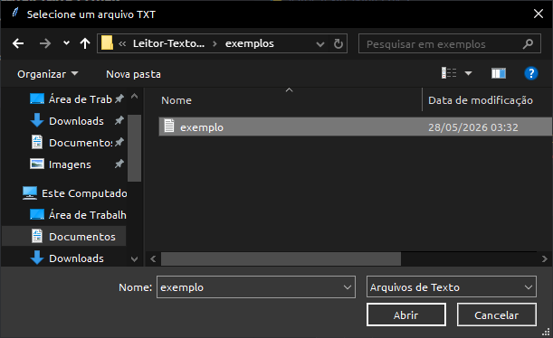

# 📄 Leitor de Arquivos TXT com Tkinter

Projeto desenvolvido em Python para realizar a leitura de arquivos de texto (.txt) através de uma interface gráfica de seleção de arquivos utilizando Tkinter.

O sistema permite que o usuário escolha um arquivo diretamente pelo explorador de arquivos do computador e visualize seu conteúdo no terminal.

---

## 📚 Sobre o Projeto

Este projeto foi criado para praticar manipulação de arquivos, tratamento de exceções e utilização da biblioteca Tkinter para interação com o sistema operacional.

Ao invés de exigir que o usuário digite manualmente o caminho do arquivo, o programa abre uma janela de seleção, tornando a experiência mais intuitiva e próxima de aplicações reais.

---

## 🚀 Tecnologias Utilizadas

* Python 3
* Tkinter
* Manipulação de Arquivos

---

## 🎯 Objetivos de Aprendizagem

Durante o desenvolvimento deste projeto foram praticados os seguintes conceitos:

* Leitura de arquivos texto
* Manipulação de arquivos
* Interface gráfica com Tkinter
* Seleção de arquivos pelo explorador do sistema
* Tratamento de exceções
* Estruturas condicionais
* Organização de código

---

## ✨ Funcionalidades

* 📂 Seleção de arquivos TXT pelo explorador do Windows/Linux
* 📖 Leitura automática do conteúdo do arquivo
* 🖥️ Exibição do conteúdo no terminal
* ⚠️ Tratamento de erros durante a leitura
* ❌ Detecção de cancelamento da seleção de arquivo
* 🔤 Suporte para caracteres acentuados utilizando UTF-8

---

## 🌎 Aplicação no Mundo Real

Embora seja um projeto simples, ele utiliza conceitos presentes em diversos sistemas profissionais.

### 📄 Leitores de Documentos

* Visualização de arquivos de texto
* Sistemas de consulta documental
* Ferramentas administrativas

### 🏢 Sistemas Empresariais

* Leitura de relatórios exportados
* Processamento de arquivos recebidos de clientes
* Importação de dados

### 📊 Ferramentas de Análise

* Carregamento de arquivos para processamento
* Leitura de logs
* Leitura de arquivos de configuração

### 🤖 Automações

* Sistemas que processam arquivos automaticamente
* Leitura de documentos para geração de relatórios
* Integração com outros sistemas

---

## 📸 Screenshots

### 📂 Seleção do Arquivo



---

### 🖥️ Conteúdo Exibido


---

### ⚠️ Tratamento de Erros


---

## ▶️ Como Executar

### 1. Clone o repositório

```bash
git clone <https://github.com/Lucksander/Leitor-Texto-Python.git>
```

### 2. Execute o programa

```bash
leitor_texto_tkinter.py
```

---

## 📁 Estrutura do Projeto

```text
leitor-arquivos-python/
│
├── README.md
├── leitor_texto_tkinter.py
│
├── exemplos/
│   └── exemplo.txt
│
└── assets/
    ├── conteudo_arquivo.png
    └── erro_leitura.png
```

---

## 📄 Exemplo de Arquivo

```text
Olá, mundo!

Este é um arquivo de texto utilizado para testar o leitor de arquivos desenvolvido em Python.
```

---

## 📌 Fluxo de Funcionamento

1. O usuário executa o programa.
2. O explorador de arquivos é aberto.
3. O usuário seleciona um arquivo `.txt`.
4. O programa lê o conteúdo.
5. O texto é exibido no terminal.
6. Caso ocorra algum erro, uma mensagem é apresentada.

---

## 🔮 Melhorias Futuras

* Interface gráfica completa
* Exibição do conteúdo em uma janela Tkinter
* Suporte para múltiplos formatos (.csv, .log, .json)
* Pesquisa por palavras dentro do arquivo
* Contagem de linhas e palavras
* Exportação do conteúdo para outro arquivo

---

## 📌 Aprendizados

Este projeto permitiu praticar conceitos importantes relacionados à leitura de arquivos e interação com o sistema operacional.

Também proporcionou experiência com interfaces gráficas simples utilizando Tkinter e tratamento adequado de erros durante operações de entrada e saída de dados.

---

## 👨‍💻 Autor

Lucas Santos
Estudante de Análise e Desenvolvimento de Sistemas
